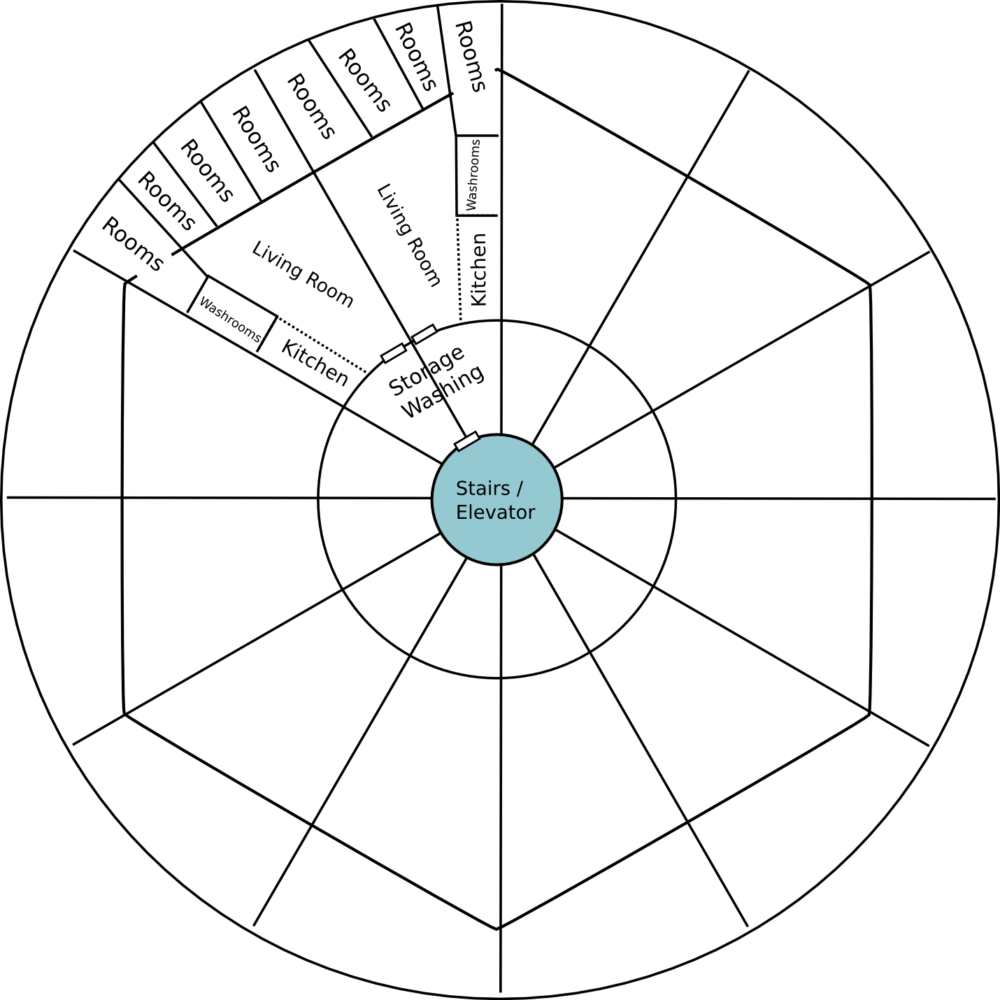
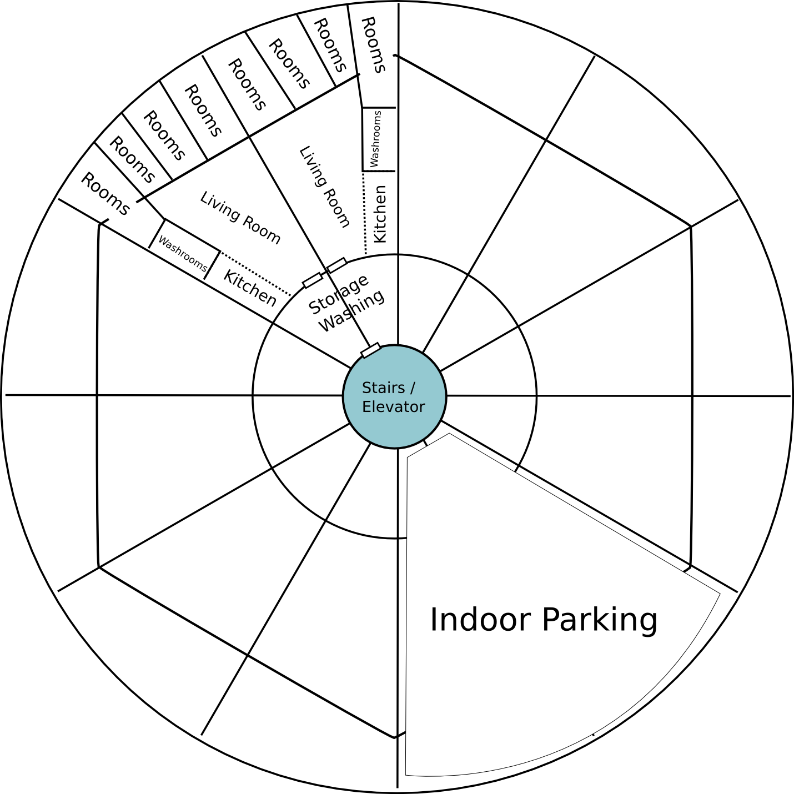
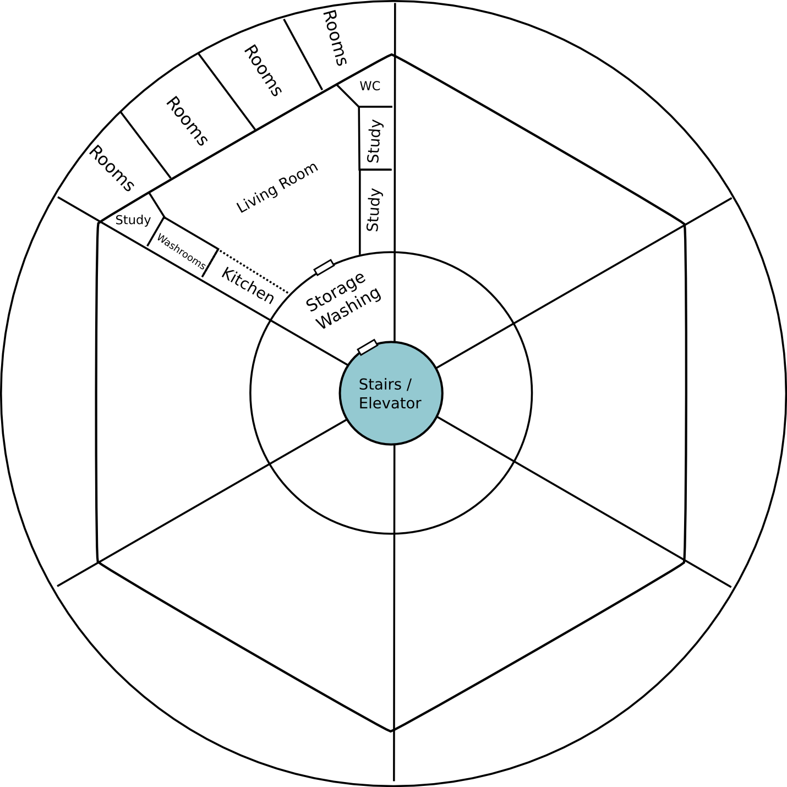

# Home

## Home Constitution

### Purpose

Planet Home’s focus is on establishing healthy, thriving families. This
is established by the physical support, mental support, and spiritual
support that parents offer to their children through relationship.

### Roles

#### Mothers

Mothers provide the physical, emotionally, and genetic support that a
child needs at their earliest stages. A child cannot function without a
mother for the first nine months of their life. It is in the best
interest of the child therefore, the maintain this connection for the
rest of their life. In the case of a dysfunctional family: Planet Home
seeks rather to help the original mother of the child find help in
raising a child, rather then to remove the child from the situation.
However, if the mother is unwilling to change, measures might need to be
taken to provide a safe home for the child. A mothers role is to work
with the resources to create a place where others can thrive.

#### Fathers

As a child also cannot be created without the help of a father, and
genetic code is passed from father to child, it is imperative that a
child know their father. It is also crucial that a father spend time
with their child, and show their love to them. Love of a father prevents
many emotional problems later in life. A fathers role is to provide the
physical resources needed for the home.

#### Younger Children (\>=12)

Younger children cannot care for themselves fully, and need supervision.
Food, Water, and Sleep are not enough for these children to thrive. They
need to have security, fun, and love in addition to grow.

#### Older Children (\<12)

Middle children represent a key transformation period. They go from
playing with toys, to playing with real life. No longer are their
amusements purely theoretical, but they transfer into situations that
have significant consequences. It is at this point that the child is
given more and more privileges to aid in their maturity development. In
addition, they might be required to care for younger children as well,
or work to help provide for the families income.

### Layout

#### Co-Ed Family

A family should not consist of more then 12 individuals, with a mother
figure and a father figure. It is ideal [if not mandatory], that this
couple be married. In planet Home a family name is given to those who
belong to a family. It is recommended children keep their original last
name, however, substituting it as a middle name. This family is for
life, and the kids will be legally adopted as children of the new
parents. It is not recommended that these parents take more then 12
children during their time as parents, as these connections should be
built for life. The more connections, the less time can be given to each
individual. This base unit of a family is designed to eat together,
often play together, and live alongside each other. A Family should
consist of both boys and girls, however, extreme care must be given. If
children are raised alongside each other from a young age, there will be
significantly less sexual attraction. Well functioning family should be
the safest place to be, for there must be much love.

#### Single Gender Family

A separate contingent of family groups will be established for the
development of kids who enter into Planet Home at a later age (10 and
up). These children still need all the love and support that the Co-Ed
Family’s provide, and so the structure will be identical, with the
exception that this family has only one gender.

#### Mentorship Family

It may come that a boy or a girl comes to planet Home needing help,
however, as they are already over the age of 16, and feel a strong need
for independence, forcing a family upon them might have a detrimental
effect. What they need is help, but not things handed to them, for they
are already at a place in life where they can provide for themselves. A
mentorship family provides the love and support necessary to build these
children up, without forcing a family they do not know on them. Could be
run by a single person (same gender as mentoree)

### Functions

#### Marriage

Marriage marks the beginning of a new family, and should not be
discouraged for the older children. The new couple then will have to
leave Planet Home, and start a new family somewhere else (hopefully
reasonable living quarters can be provided for). This breaks the cycle
of physical poverty given to these children, and allows them with a
solid foundation to start a new life. There is no age limit on marriage,
but rather a focus on maturity of the individuals to spend their life
together. The host parents need to be involved in the establishment of
this new marriage, providing counsel for the newly-weds. All those
wishing to get married must have the firm mindset that marriage is
forever. A marriage ceremony should be conducted without going into
debt. As many newlyweds do not have the funds, parents will offer to pay
for parts of the wedding.

#### Family

It is important to have homes in the context of family. Individual homes
should make an effort to meet with family members often. For those who
do not have family, homes will be paired with homes for the purpose of
family.

#### Friends

Children also need to have friends, and having families interact with
each other brings about an opportunity for kids to meet and play with
other kids.

#### Physical Needs

Home provides not only the physical needs of a child, but the training
of children in physical safety, rest, relaxation, exercise, etc.

### Integration

#### Church

Students should be provided with spiritual instruction, however, it
should not be the role of those with the spiritual gift of teaching to
teach those students. Families have the obligation to teach their
children much of what the Bible says, from praying before meals, to
doing devotions at night, but a child also needs to be with other
believers who commonly meet together. It is this environment that
provides the growth needed to transform a new Christian into a strong
Christian. A family must make the attempt to continue to meet with other
believers regularly for the purpose of spiritual growth. This is
accomplished by the core group in church. A single family meets with
other families to compose this group. Meeting regularly, they encourage
each other in life.

#### School

School is a must for all kids, and all students go to school.

Children should be taught by their parents or family member until the
age of 11. If this is an impossibility, the school does provide
education at the facility, but it is with involvement from parents
attending a church.

Dating
------

### Purpose

Dating is the process in which to find a life-long mate

### Procedure

The aspiring man/woman has 3 options:

-   Option 1: Ask their parents to find a mate

-   Option 2: (male) Look for a mate on their own

-   Option 3:Aspire to live a life of singleness until further notice

#### Option 1

The parents of the man, in collaboration with the parents of the woman,
bring the couple together. The couple is both under the assumption that
the other is looking for a marriage partner. After a maximum of 3
months, the man/woman must decide if this is the woman he/she wants to
marry, and the man must propose. At this point the relationship moves
into the Engagement stage.

#### Option 2

The man looks for a future spouse on his own. Once he has found a
potential wife, he must get approval from her parents, and his parents
before going on the first date. At this point the same method follows as
Option 1.

#### Option 3

A man or woman seeking to be devoted to the Lords Work may desire to not
seek a wife or husband. They must not be condemned as forsaking the
raising of children, for their mission is now to raise the children of
God.

#### Codes of Conduct

During these periods, the man should refrain from physical interaction
as much as possible, so that the marriage day may be the first time the
couple touch.

To further push this policy: all dates must be in open places. Dates
cannot be held in personal rooms, or in houses with no one home. Treat
the other as you would a brother or sister.

Sex before marriage is absolutely prohibited, as it shames the image of
the union between Christ and His Church. Those who cannot wait are
encouraged to marry quickly.[^1]

Wedding
-------

### Definition

Marriage is a joining of a man and a woman to become one flesh, applying
to physical, emotional, intellectual, and spiritual intimacy. It is the
process in which two separate individuals become one. As one cannot
separate himself, marriage reflects a life-long commitment. Marriage has
not happened until this commitment is made public.

### Process

#### Part 1: Engagement

The man promises himself to the woman, and she wears a symbol of his
love. He also wears the same symbol.[^2] They both sign the certificate
for marriage on this day, agreeing to love each other, and have it
signed by the bride’s parents as well. For the remainder of this time,
she no longer has any contact with him. This phase should take at a
maximum 3 months. At the final day, she will wait. Not knowing the hour,
but waiting until he comes. When he does come, the ceremony will begin.
Breaking this agreement is par with divorce.

#### Part 2: Coming

The man, along with the guests of the party, arrive at the bride’s
house, and walk over with singing to the groom’s house. The groom, along
with the bridal party, escort the bride and groom to their new home,
where the marriage is consummated.[^3]

#### Part 3: Party

The party returns, joyful, and the party begins. This is meant to be a
relaxing party, with stories, dancing, singing, and at the very end, the
Lords supper, and a reminder that we wait his return.

The bridal party are the witnesses to the marriage, and they pledge to
help the new couple in their marriage.

### Remarks:

-   this can happen outside of a religious building.

-   Far cheaper

-   Bride and Groom wear matching white robes, can change later

-   The parents off to pay for parts of the wedding, and possibly
    honeymoon.[^4]

Marriage
--------

### Purpose

Marriage is a reflection of Christs relationship to His church.
Relationships are more then a one time event, it takes a lifetime of
learning and growth. There is a danger for couples to grow cold to each
other, to forget their commitment, and leave each other, for the
destruction of their children and themselves. The Home organization, in
partnership with the church and school, is committed to helping couples
maintain this relationship

### Foundation

According to the Fundamental Belief of relationship:

1.  Relationship requires exploration

2.  Relationship requires physical interaction

3.  Relationship requires giving of ourselves

4.  Relationship requires commitment

5.  Relationship requires communication

6.  Relationship requires submission to each other

7.  Relationship requires change and repentance

8.  Relationship requires living life together

9.  Relationship requires love

### Theory

To this end:

Couples should

1.  Purposefully explore each other (spiritually, emotionally,
    intellectually, physically)

2.  Touch each other (skin to skin), and be around each other after
    work.

3.  Take time to do something the other

desires

1.  Be committed to each other

2.  Communicate with each other about how they are doing (and how their
    relationship is going)

3.  Submit to one

another

1.  Change when something is wrong with the relationship

2.  Live life together (in the same bed, at the same table, in the same
    house)

3.  Love each other

### Practice

-   Daily: The couple spends time to go over how the day went, and how
    they feel

-   Weekly: the couple spends an evening all by themselves (one week the
    wife chooses, the next, the husband)

-   Monthly: the couple spends a full night without the kids being there
    (can be merged with a weekly date night)

-   Yearly: A week getaway where the couple brings enough food, but no
    telecommunication.

Education
---------

Home will also implement the levels approach to educating kids. It is
the parents responsibility, and not the teachers, to develop moral
citizens. This is a loose guide for parents to follow. Students will not
be tested on the following, but it is the parents responsibility to
educate their own kids. The school will check in on parents to see how
things are going, and provide them with resources as needed.

### Health \$ Safety

1.  Eating right (5 levels)

2.  Sleeping

3.  Staying safe outside

4.  Relationships

5.  Time management

6.  Stress

7.  Habits

8.  Marriage \$ Sex

Floor Plans
-----------

The idea behind communal living is such:

-   Cheaper upkeep (as less surface area exposed to outside)

-   Housing for new families (in the context of friends / families)

    -   (Thus making marraige a possibility for those who are not well
        to do financially)

-   Community focus, brings people together (not apart)

-   Large gathering areas for social functions (ie: church services)

Each unit can be customized for which types of floors it encorperates

The expected housing capacity is as follows:

-   Large - 8 \* 6 apartments = 48 people

-   Medium - 6 \* 12 = 60 people

-   Small - 4 \* 16 = 64 people

There is no expected elevator, making 4 floors an logical limit (for a
maximum capacity then of 256 people)

[^1]: 1 Corinthians 7:9

[^2]: This is not to say that all marriages should proceed. This is
    simply an example to emphasize the picture of Christ and His Church

[^3]: This emphasizes the fact the couple has been waiting for sexual
    intimacy until their declaration of love before a community. It also
    acknowledges that sexual intimacy is part of becoming one flesh.
    Some may be incapable of sexual intimacy for biological reasons.
    This does not mean they are not married. However, for those that
    can, should recognize that sexual intimacy is important to the
    process

[^4]: New couples should not be worrying about the expenses of a wedding
    during this time. This is meant as a celebration, and a welcome into
    the next chapter of their lives. To go into debt for a wedding is
    financially wrong
