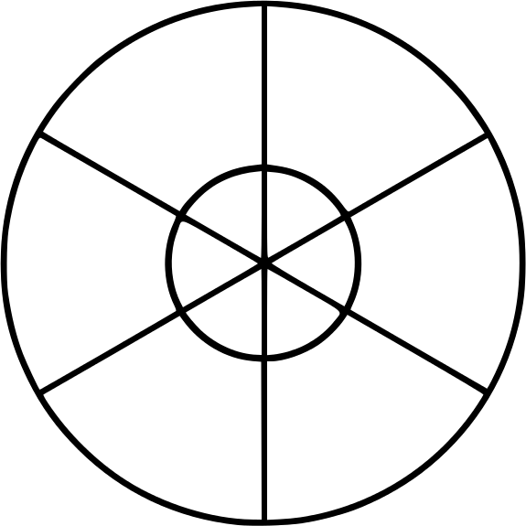
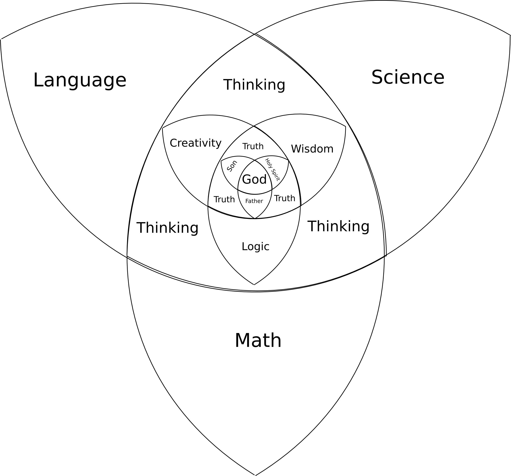
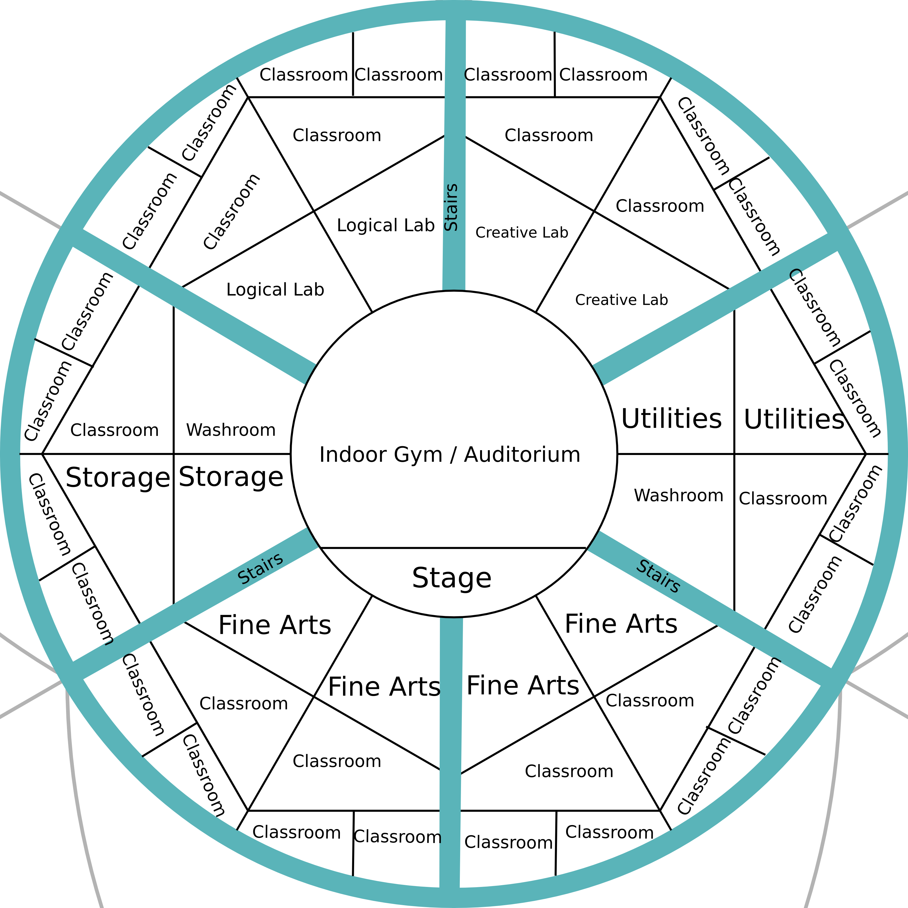
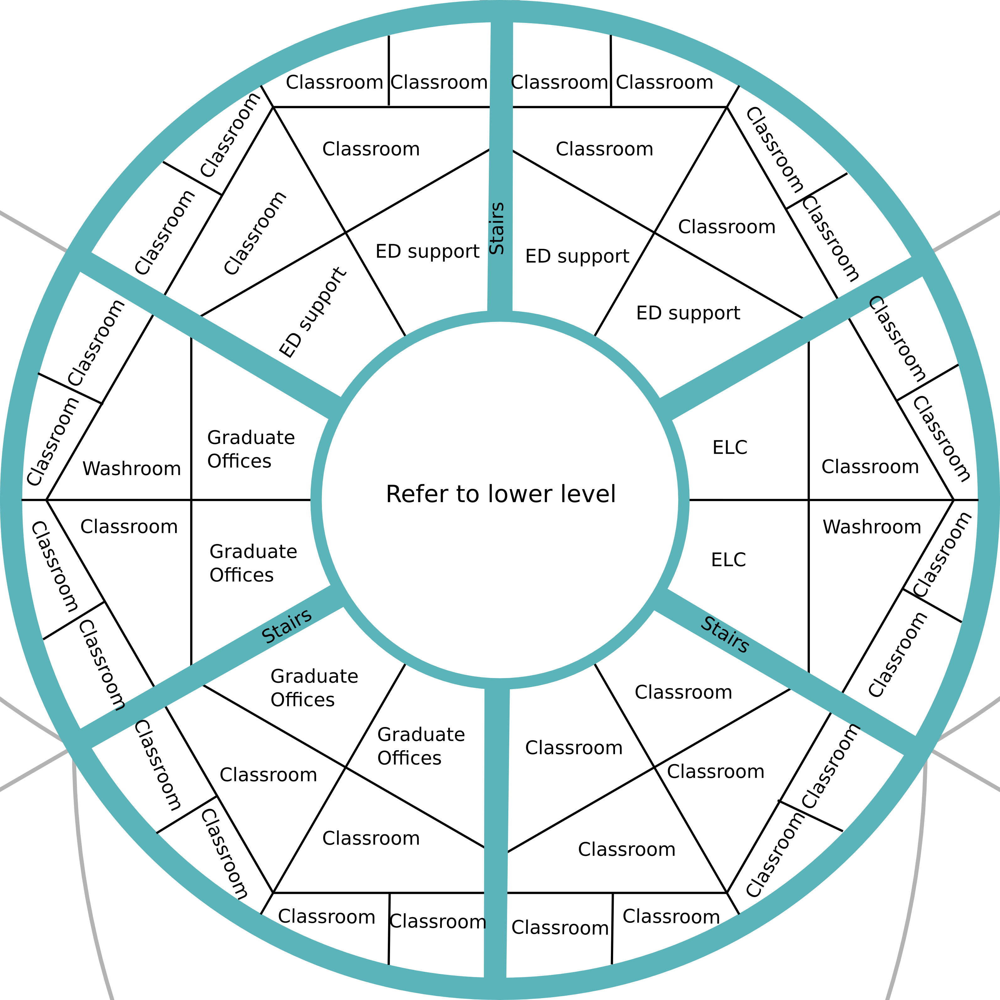

School
======

School Constitution
-------------------

### Purpose

The School Community exists to educate students intellectually. To
educate students well mentally requires spiritual education, emotional
education, and physical education. Planet School will serve as the
primary component of a students intellectual education, while allowing
various other entities to contribute to a child’s full development.

Planet School purpose is the transfer of knowledge centred around God,
creating students who are physically fit, mentally sound, and
spiritually alive.

### Organization

#### Teachers

Teachers have a relationship with a specific knowledge; their role is to
help foster a relationship between the student and this knowledge. To
accomplish this, teachers must have a relationship with the students.
Teachers are administrators, in the sense that collectively they work
together to keep the school running well. The head teacher, considered
First Among Equals makes sure the operation of the school is smooth.

#### Students

Students goal is to build a relationship with knowledge. The most
effective way for students to do this is to build a relationship with a
teacher. Other forms include learning from a teacher without
relationship, and investigating the knowledge without a teacher, but
neither of these two systems are as effective as the first. As students
gain knowledge, they are then capable of imparting that knowledge to
other students

### Development

#### Primary Development

This stage is from age 0 to 12. This focuses on the core curriculum
aspects. This stage is taught with close connection with the parents.
The school provides curriculum, events, and peer to peer relationships
in a home school environment. Parents are encouraged to educate their
children until until 12, at which point they will continue their
education at the school. For broken families, or families where this is
not possible, the school provides education for these children, bringing
in parents belong to a church. In such a case, students will be educated
about the foundations of Christianity.

#### Secondary Development

This stage is from 12-18, and continues the development started in the
Primary stage. Students at the end of this will have the skills required
to learn any job.

#### Tertiary Development

This stage is from 18-24, and is the last level in the development.
Students will learn specific career skills, and/or participate in
internships under a master.

### Functions

#### Group meetings

The school once a week comes together as a whole (Tier 3) to discuss
current happenings and learning.

#### Homework

Adequate time is given in the school day to complete all homework
assigned. Time is taken out of extra curricular activities to complete
homework if not done.[^1]

#### Calendar

Each class takes 2 weeks to complete. You can enroll in a maximum of 2
classes at any time. there are 16 instructional weeks in semester 1
(January to May). Thus one may complete 8 levels per semester at relaxed
pace, and 16 levels at a normal pace. This allows students who fail a
class to repeat it immediately.

Classes go Monday to Saturday (with Sunday being the day of rest -
School is not open)[^2]

Semester 2 begins in the last week of July, and also runs 16 weeks.

20 weeks off (no work may be scheduled for students during this time)

-   9 weeks off during the summer

-   3 weeks between semesters (1 after every 4 weeks)

-   4 weeks off first semester

-   4 week off second semester

Could schools provide fun activities for students during these weeks
off?

#### School day

Before 9: open work time (reading time)

-   9-10: T1 - A)[^3]

-   10-11: T2 - A

-   12 - 1: Lunch (T3)

-   1 - 4: Period 2 (T1 + T2 Classes)

-   4-6: Extra curricular and work session (T2)

### Layout

#### Group Meeting Area

The purpose of this location is to bring the whole school together, for
large presentations, or gatherings. Maximum of 1,500.

#### Group Learning Areas

The purpose of this location is to provide an area for educators to
present their lessons in whatever form they choose. Maximum of 60
students.

#### Individual learning Areas

The purpose of this location is to provide a space for students to work
on assignments and learn on their own. This is a group location, so that
collaboration can happen. Teachers rooms are located in this area, so
that students can get immediate help, either from teachers or peers, for
concepts they do not understand. Individual learning areas are broken up
into groups of 12 people max. An older teacher or student, while working
on their own work, supervises the group.

#### Specialized areas

##### Kitchen

Proving food for students. Also doubles to serve the homeless and needy,
and proving food for Church.

##### Creative Labs

Providing spaces to practice the creative arts.

##### Science Labs

Proving spaces to investigate and work on the sciences

##### Math Labs

Providing spaces to use and apply math. Engineering and computers are in
this area

##### Garden (Biodome)

This provides food and relaxation for the school. Biology students also
use this location for their lab.

##### Admin

Provides organization to the school

##### Library

Source of materials for the school

Curriculum
----------

For every thing a child learns, they only learn the outside of the
knowledge. Knowledge, as far as I can tell, is composed of 3 parts

-   The Core (the fundamental truth that lies within)

-   The History of how that truth was practised and interpreted

-   The current application of that knowledge, building on the history
    and the truth, to create: culture.

All students first learn the culture of knowledge, the accepted norms
and procedures associated with each piece of knowledge they acquire.
Students engaging in higher levels of study will review the previous
knowledge they gained, understanding the history, and then the truth of
the knowledge.

-   Tier 1 $ \pi \times e^{1} \cong 9 \Longrightarrow $ 1 - 9 students

-   Tier 2 $ \pi \times e^{2} \cong 23 \Longrightarrow $ 10 - 23
    students

-   Tier 3 $ \pi \times e^{3} \cong 63 \Longrightarrow $ 24 - 63
    students

-   Tier 4 $ \pi \times e^{4} \cong 172 \Longrightarrow $ 64 - 172
    students

These naturally represent ideal numbers, and should not be taken as
absolutes.

### Core

At the core of every individual is their relationship to God. To begin
all development of intellectual, emotional, physical, and spiritual
growth, the individual must have an understanding of God and their
relationship to Him (Father, Son, Holy Spirit). It is primarily taught
in the home school phase, and then built upon in the high school phase.

### Lower and Upper Mantle

#### Primary (6 - 12)

School does accept students as young as 5, but this is not encouraged.
the school provides support materials for parents seeking to home school
their children. The rec commended age to stop home schooling is 12. For
children under the age of 12 they will be assigned to one teacher until
they reach high school. This teacher will have 12 students under them.
The idea is to provide a concrete learning base similar to children in
home school situations. It would be great if a local parents under
approval from the church agrees to do this. They do not need a degree to
do this, and will be paid the expected wage. Children will be taught
from a Christian Worldview.

#### Secondary(12 - 18)

I think the best way to implement this is to have a levels based
approach. In which you can only progress to the next level of music once
you have completed a previous level in math. In this way all the
subjects and both the hemispheres (logic and creativity) are intertwined
with each other. As there will be a limited amount of teachers accepting
students for a particular class, students may take a higher level class
(so long as they have met the requirements). When a lower level class
opens up, they then proceed to take that.

Teachers are assigned 12 students to teach for 3 weeks. They will teach
them everything they need to know on a particular topic. They have 3
hours per day with each class. Teachers will teach 2 classes a day. Each
class will involve whatever the instructor deems best to learn the
material.

Classes are split into 2 week blocks, with 2 classes per 2 week block
(morning \$ afternoon)

##### Logic - Math \$ Science

-   Learning to think linearly

-   Problems and Solutions

-   Observations, Analysis, and Predictions

-   The study of the physical world and how it works

##### Creativity - Language \$ Communication

-   Learning to think Abstractly

-   Organizing, and Reorganizing

-   The process of taking an existing item and transforming it into
    something new

-   The process of reading and writing according to standard rules

-   Speaking with clarity

#### Tertiary(18 - 22)

This should theoretically be every occupation that a student might
pursue

The school will work in conjunction with other local businesses, to
provide internships as much as possible

Some careers, however, will need to continue into higher education

##### Engineering

-   Computer

-   Physical

-   Chemical

##### Scientist

-   Math

-   Biology

-   Chemistry

-   Physics

##### Theology (working with the local Church)

-   Pastoring

-   Church History

-   Greek

-   Hebrew

-   Evangelism

-   Interpreting the Bible

-   Preaching

##### Linguistics

-   Foreign Languages

-   Foreign Cultures

#### Others

-   Artists

-   Business

-   Social Services

-   Educators

The above should learn via an extended internship

### Classes

#### Tier 1 classes

-   Small group

-   discussion and repetition

-   coaching

#### Tier 2 Classes

-   Under 60 students

-   Some structure

-   Lecture

#### Tier 3 Classes

-   large assembly

-   most structure for speakers

### Levels

There is a mistaken idea among schools that if we group students by age,
we will be offering the best education to each individual student. This
is simply not the case. Students learn best when content and material is
matched to their level of competence.

In the primary section, this is accomplished by providing work materials
that are best suited for the individual student.

In the secondary section, this is accomplished by having different
instructors teach different levels of content to their students.
Students who fail to pass the 2 week course will simply redo it at a
later late. Students will not pass to the next level of education
without having completed the previous level.

In the Tertiary section, students studying will adhere to the same
procedure as the secondary section, but in an internship sitting, they
will not pass the internship until the instructor can say they are
competent.

All subject areas will need to be divided into levels.

#### Math\\Science (64 levels)

1.  Observation

2.  Counting

3.  Analysis

4.  Lengths

5.  Addition / subtraction

6.  Shapes

7.  Multiplication (2 levels)

8.  Graphing

9.  Area

10. Graphing

11. Solving for unknowns

12. Linear Equations

13. Matrices (3 levels)

14. Geometry (5 levels)

15. Powers

16. Objects

17. Imaginary Numbers

18. Proofs \$ Logic (5 levels)

    1.  Computer Science (5 levels)

19. Derivatives (5 levels)

20. Calculus (10 levels)

    1.  Physics (5 levels)

    2.  Chemistry (5 levels)

    3.  Biology (5 levels)

#### Writing\\Communication (64 levels)

1.  Letters (10 levels)

2.  Words (10 levels)

3.  Sentences (9 levels)

4.  Paragraphs (10 levels)

5.  Essays (5 levels)

6.  Speaking (5 levels)

7.  Drawing (5 levels)

8.  Music (5 levels)

9.  Acting (5 levels)

### Map

Floor Plans
-----------

[^1]: There are a couple reasons for doing so. One is to provide help
    for students while doing homework. Two is to give students time to
    spend time with family and friends outside of school. Three is to
    mirror a work day, in which homework is rarely assigned. This is
    accomplished through the longer work day. Given that there is
    additional work (such as taxes, etc.) but I feel that the normal
    activities of a home (caring for siblings, making supper, cleaning,
    other pursuits) could easily also teach this.

[^2]: The reason for having a 6 day work period is because first of all
    its biblical. God worked 6 days, and rested on the 7th. This
    addition also allows schools to progress though material much
    faster, and provides more holidays for students. Arguably, students
    feel more rested per time time for a holiday, then any weekend.

[^3]: Tier 1 - Class ’A’

